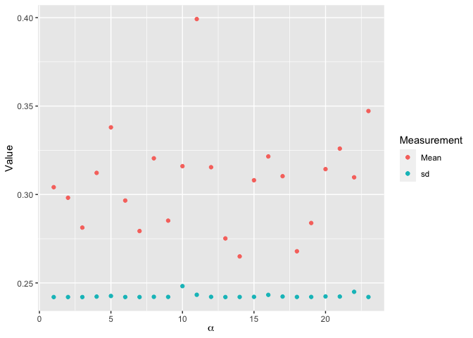
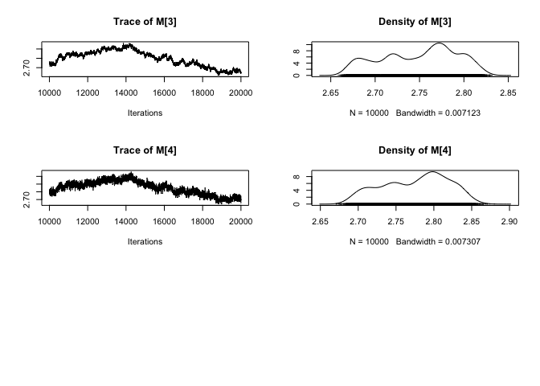
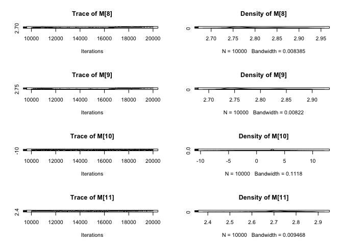
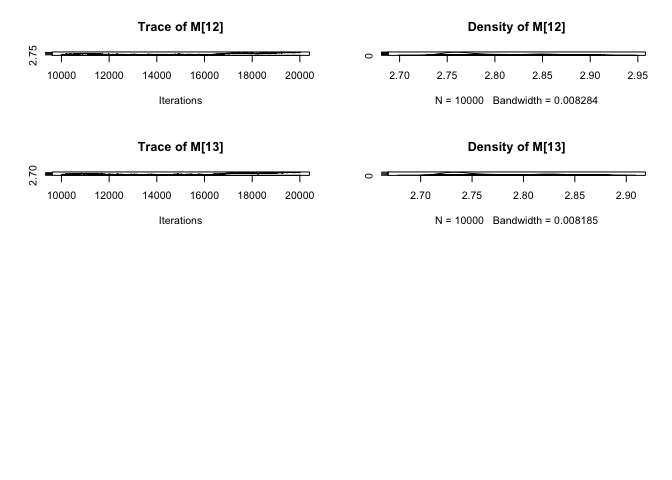

Vaporfly
================
Robert West
5/11/2021

# Introduction

Since their introduction to the market in 2016, Nike’s `Vaporfly` shoes
have set the marathon community ablaze. The shoes are supposedly
designed with the intent of optimizing every step that a runner takes.
Huge accomplishments in marathon racing have been made during this time
as well, including Nike’s project of breaking the daunting 2-hour
barrier. The release of `Vaporflys` along with the decrease in marathon
times has led many to criticize the use of the shoes, suggesting that
there is a substantial mechanical advantage to those who wear them. Some
have gone as far to call the use of the shoes “Mechanical Doping” and
call for bans on them in official races. The goal of this analysis is
not to argue for or against their use, but simply to determine if the
use of Nike Vaporflys has any effect on the time of marathon runners and
if that effect is changed across gender, individual runner, and marathon
course.

# Packages

``` r
library(rjags)#MCMC
library(coda)#MCMC
library(ggplot2)#Data Visualization
library(tidyr)#Data tidying
library(dplyr)#Data wrangling
library(varhandle)
library(knitr)#Display tables
library(readr)
```

# Data Import

``` r
men = read_csv("men_sampled_shoe.csv", col_names=T)%>%
  select(name_age, match_name, marathon, year, time_minutes, vaporfly)%>%
  mutate(sex=0)
women = read_csv("women_sampled_shoe.csv", col_names=T)%>%
  select(name_age, match_name, marathon, year, time_minutes, vaporfly)%>%
  mutate(sex=1)
```

# Data Cleaning

``` r
final = full_join(men, women) %>%
  mutate(
    name_age = trimws(name_age, which="right"),
    age = ifelse(check.numeric(substr(name_age, nchar(name_age)-2, nchar(name_age)-1)), 
                 as.numeric(substr(name_age, nchar(name_age)-2, nchar(name_age)-1)),
                 0)
  )%>%
  filter(!is.na(vaporfly))
```

# Visualizations

<!-- --><!-- --><!-- --><!-- --><!-- --><!-- --><!-- -->

# Methods

To determine the effect of Vaporflys, I utilized a mixture of Bayesian
Linear Regression, Bayesian Mixed-Random Effects, and Bayesian
Multi-level Interaction Models to attempt to explain the overall effect
that the shoes have on marathon times when applied to different genders,
runners, and courses. Upon first inspection, the distribution of time
was bi-modal (figure 1).

<!-- -->

The 2 peaks of this distribution were explained by the differences in
male and female performances. The distributions of time conditioned on
sex were both bell-shaped and skewed to the right, which suggests that
sex should play a role in the marathon time of an individual. While not
surprising, this added the need to include sex as a predictor in each
model to avoid fitting every model for men and women.

<!-- -->

For every model, instead of treating the raw time as the response, I
treat log(time) as the response as the time variable was a little too
right-skewed to meet the Normality condition of my models. Taking the
log allowed for more reasonable Gaussian assumptions (Figure 2, 3).
Using a consistent Log-Normal likelihood allowed for more precise model
comparison after fitting as
well.

<!-- --><!-- -->

# Creating analysis variables

``` r
y = final$time_minutes
logy = log(y)
X = cbind(1, final)
n = length(logy)
```

# Models Under Consideration

## Model 1

  
 \\sim N(\\mu_i, \\sigma^2)\\\\
\\mu_i = B_0 + B_1V_i\\\\
V_i \\in {0,1}: Vaporfly_i\\\\
B_0, B_1 \\sim N(0, (\\sqrt{10})^2)\\\\
\\sigma^2 \\sim InvGamma(0.1, 1)
")  

This model suggests that the only contributing factor to a runner’s time
is the binary `vaporfly` variable:

``` r
X_mod = X%>%select(1, vaporfly)%>%
  mutate(vaporfly = as.numeric(vaporfly))
data = list(X_mod=X_mod, n=n, logy=logy)

model_string = textConnection("model{
    #Likelihood 
    for(i in 1:n){
      logy[i] ~ dnorm(mu[i], tau)
      mu[i] = B1*X_mod[i,1] + B2*X_mod[i,2]
    }
    
    #Priors
    B1 ~ dnorm(0, 1/10)
    B2 ~ dnorm(0, 1/10)
    tau ~ dgamma(0.1, 1)
    sigma = 1/sqrt(tau)
}")

#Initialize parameters and construct model
inits = list(B1=0, B2=0, tau=1)
model = jags.model(model_string, data=data, inits=inits, n.chains=2, quiet=T)

#Thin the burn-in samples
update(model, 1000, progress.bar="none")

params = c("B1","B2","sigma")
samples = coda.samples(model, variable.names = params, n.iter=2000, progress.bar="none")

#Compute DIC
dic_1 = dic.samples(model, n.iter=2000, progress.bar="none")
```

    ## 
    ## Iterations = 1001:3000
    ## Thinning interval = 1 
    ## Number of chains = 2 
    ## Sample size per chain = 2000 
    ## 
    ## 1. Empirical mean and standard deviation for each variable,
    ##    plus standard error of the mean:
    ## 
    ##          Mean       SD  Naive SE Time-series SE
    ## B1     5.0060 0.002502 3.956e-05      4.527e-05
    ## B2    -0.0315 0.007048 1.114e-04      1.285e-04
    ## sigma  0.0939 0.001645 2.600e-05      2.573e-05
    ## 
    ## 2. Quantiles for each variable:
    ## 
    ##           2.5%      25%      50%      75%    97.5%
    ## B1     5.00116  5.00427  5.00596  5.00768  5.01089
    ## B2    -0.04512 -0.03629 -0.03159 -0.02675 -0.01752
    ## sigma  0.09076  0.09279  0.09387  0.09500  0.09711

<!-- -->

    ## Potential scale reduction factors:
    ## 
    ##       Point est. Upper C.I.
    ## B1             1       1.01
    ## B2             1       1.01
    ## sigma          1       1.00
    ## 
    ## Multivariate psrf
    ## 
    ## 1

By popular convergence diagnostics (Gelman Statistic and Trace Plots),
this model has converged to the parameter estimates given. Now, we fit
more sophisticated models to attempt to characterize the relationship
more thoroughly.

## Model 2

  
 \\sim N(\\mu_i, \\sigma^2)\\\\
\\mu_i = B_0+B_1V_i+B_2S_i\\\\
V_i \\in 0,1: Vaporfly\\\\
S_i \\in 0,1: Sex\\\\
B_0, B_1, B_2 \\sim N(0, 10)\\\\
\\sigma^2 \\sim InvGamma(0.1, 1)\\\\
")  

``` r
X_mod = X%>%select(1, vaporfly, sex)%>%
  mutate(vaporfly = as.numeric(vaporfly))
p = ncol(X_mod)
data = list(X_mod = X_mod, logy=logy, n=n, p=p)

model_string = textConnection("model{
    #Likelihood
    for(i in 1:n){
      logy[i] ~ dnorm(mu[i], tau)
      mu[i] = inprod(X_mod[i,], B[])
    }
    
    #Priors
    for(j in 1:p){
      B[j] ~ dnorm(0, 1/10)
    }
    
    tau ~ dgamma(0.1, 0.1)
    sigma = 1/sqrt(tau)
}")

inits = list(B=rep(0,p), tau=1)
model = jags.model(model_string, data=data, inits=inits, n.chains=2, quiet=T)

update(model, 10000, progress.bar="none")

params = c("B","sigma")
samples = coda.samples(model, variable.names = params, n.iter=3000, progress.bar="none")

#Convergence criterion
summary(samples)
```

    ## 
    ## Iterations = 10001:13000
    ## Thinning interval = 1 
    ## Number of chains = 2 
    ## Sample size per chain = 3000 
    ## 
    ## 1. Empirical mean and standard deviation for each variable,
    ##    plus standard error of the mean:
    ## 
    ##           Mean        SD  Naive SE Time-series SE
    ## B[1]   4.93657 0.0019214 2.480e-05      4.536e-05
    ## B[2]  -0.01882 0.0038128 4.922e-05      5.688e-05
    ## B[3]   0.14100 0.0026405 3.409e-05      5.911e-05
    ## sigma  0.05230 0.0009221 1.190e-05      1.190e-05
    ## 
    ## 2. Quantiles for each variable:
    ## 
    ##           2.5%      25%      50%      75%    97.5%
    ## B[1]   4.93295  4.93526  4.93654  4.93786  4.94037
    ## B[2]  -0.02612 -0.02145 -0.01883 -0.01628 -0.01114
    ## B[3]   0.13588  0.13920  0.14104  0.14281  0.14602
    ## sigma  0.05055  0.05168  0.05228  0.05291  0.05411

``` r
gelman.diag(samples)
```

    ## Potential scale reduction factors:
    ## 
    ##       Point est. Upper C.I.
    ## B[1]           1          1
    ## B[2]           1          1
    ## B[3]           1          1
    ## sigma          1          1
    ## 
    ## Multivariate psrf
    ## 
    ## 1

``` r
#Compute DIC
dic_2 = dic.samples(model, n.iter=3000, progress.bar="none")
```

## Model 3

  
 \\sim N(\\mu_i, \\sigma^2)\\\\
\\mu_i = \\beta_0+\\beta1V_i+C_1S_i+\\beta_3S_i*V_i\\\\
V_i \\in 0,1: Vaporfly\\\\
S_i \\in 0,1: Sex\\\\
\\beta_i \\sim N(0, 10)\\\\
C_1 \\sim N(0, 10)\\\\
\\sigma^2 \\sim InvGamma(0.1, 1)\\\\
")  

``` r
X_mod = X%>%select(1, vaporfly, sex)%>%
  mutate(vaporfly = as.numeric(vaporfly))
p = ncol(X_mod)

data = list(logy=logy, X_mod=X_mod, p=p, n=n)

model_string = textConnection("model{
    #Likelihood
    for(i in 1:n){
      logy[i] ~ dnorm(mu[i], tau)
      mu[i] = inprod(X_mod[i,], B[]) + C*X_mod[i,2]*X_mod[i,3]
    }

    #Priors
    for(j in 1:p){
      B[j] ~ dnorm(0, 0.1)
    }
    
    C ~ dnorm(0, 0.1)
    tau ~ dgamma(0.1, 1)
    sigma = 1/sqrt(tau)
}")

inits = list(B=rep(0, p), C=0, tau=1)
model = jags.model(model_string, data=data, inits=inits, n.chains=2, quiet=T)
update(model, 1000, progress.bar="none")

params = c("B", "C", "sigma")
samples = coda.samples(model, n.iter=2000, progress.bar="none", variable.names = params)

summary(samples)
```

    ## 
    ## Iterations = 1001:3000
    ## Thinning interval = 1 
    ## Number of chains = 2 
    ## Sample size per chain = 2000 
    ## 
    ## 1. Empirical mean and standard deviation for each variable,
    ##    plus standard error of the mean:
    ## 
    ##             Mean       SD  Naive SE Time-series SE
    ## B[1]   4.936e+00 0.002304 3.644e-05      7.125e-05
    ## B[2]  -1.888e-02 0.006034 9.541e-05      1.732e-04
    ## B[3]   1.411e-01 0.003293 5.206e-05      1.031e-04
    ## C     -2.391e-05 0.009571 1.513e-04      2.647e-04
    ## sigma  6.208e-02 0.001084 1.714e-05      1.714e-05
    ## 
    ## 2. Quantiles for each variable:
    ## 
    ##           2.5%       25%        50%       75%     97.5%
    ## B[1]   4.93199  4.934947  4.9364741  4.938017  4.940946
    ## B[2]  -0.03061 -0.022990 -0.0188307 -0.014907 -0.007318
    ## B[3]   0.13485  0.138893  0.1410689  0.143390  0.147600
    ## C     -0.01880 -0.006485 -0.0001784  0.006318  0.018376
    ## sigma  0.06000  0.061345  0.0620616  0.062815  0.064276

``` r
gelman.diag(samples)
```

    ## Potential scale reduction factors:
    ## 
    ##       Point est. Upper C.I.
    ## B[1]           1       1.00
    ## B[2]           1       1.01
    ## B[3]           1       1.00
    ## C              1       1.00
    ## sigma          1       1.00
    ## 
    ## Multivariate psrf
    ## 
    ## 1

``` r
dic_3 = dic.samples(model, n.iter=2000, progress.bar="none")
```

## Model 4

  
 \\sim N(\\mu_i, \\sigma^2)\\\\
\\mu_i = \\beta_0+\\beta1V_i+\\beta_2S_i+\\beta_3S_i*V_i + \\alpha_i\\\\
V_i \\in 0,1: Vaporfly\\\\
S_i \\in 0,1: Sex\\\\
\\alpha_i: marathon \\space \\space effect\\\\
\\beta_i \\sim N(0, 10)\\\\
\\alpha_i \\sim N(0, 10)\\\\
\\sigma^2 \\sim InvGamma(0.1, 1)\\\\
")  

``` r
X_mod = X%>%select(1, vaporfly, sex, marathon)%>%
  mutate(vaporfly = as.numeric(vaporfly),
         marathon = as.numeric(factor(marathon)))
n_mar = length(unique(X_mod$marathon))

data = list(logy=logy, n_mar=n_mar, X_mod=X_mod, n=n)

model_string = textConnection("model{
  #Likelihood
  for(i in 1:n){
    logy[i] ~ dnorm(mu[i], tau)
    mu[i] = B0 + B1*X_mod[i,2] +B2*X_mod[i,3] + alpha[X_mod[i,4]]
  }
  
  #Random effects
  for(j in 1:n_mar){
    alpha[j] ~ dnorm(0, 10)
  }
  
  B0 ~ dnorm(0, 0.1)
  B1 ~ dnorm(0, 0.1)
  B2 ~ dnorm(0, 0.1)
  tau ~ dgamma(0.1, 1)
  sigma = 1/sqrt(tau)
}")

inits_random = list(B0=0, B1=0, B2=0, alpha=rep(0, n_mar), tau=1)
model = jags.model(model_string, data=data, inits = inits_random, n.chains = 2, quiet=T)
update(model, 10000, progress.bar="none")

params = c("B0", "B1", "B2", "alpha", "sigma")
samples = coda.samples(model, variable.names = params, n.iter=50000, progress.bar="none")

gelman.diag(samples)
```

    ## Potential scale reduction factors:
    ## 
    ##           Point est. Upper C.I.
    ## B0              1.01       1.05
    ## B1              1.00       1.00
    ## B2              1.00       1.00
    ## alpha[1]        1.01       1.05
    ## alpha[2]        1.01       1.05
    ## alpha[3]        1.01       1.05
    ## alpha[4]        1.01       1.04
    ## alpha[5]        1.01       1.04
    ## alpha[6]        1.01       1.05
    ## alpha[7]        1.01       1.05
    ## alpha[8]        1.01       1.04
    ## alpha[9]        1.01       1.05
    ## alpha[10]       1.01       1.03
    ## alpha[11]       1.01       1.04
    ## alpha[12]       1.01       1.05
    ## alpha[13]       1.01       1.05
    ## alpha[14]       1.01       1.05
    ## alpha[15]       1.01       1.05
    ## alpha[16]       1.01       1.04
    ## alpha[17]       1.01       1.04
    ## alpha[18]       1.01       1.05
    ## alpha[19]       1.01       1.05
    ## alpha[20]       1.01       1.04
    ## alpha[21]       1.01       1.04
    ## alpha[22]       1.01       1.04
    ## alpha[23]       1.01       1.05
    ## sigma           1.00       1.00
    ## 
    ## Multivariate psrf
    ## 
    ## 1.01

``` r
#Compute DIC
dic_4 = dic.samples(model, n.iter=50000, progress.bar="none")
```

This model suggests that there is no significant difference between
marathon courses since the effective sample sizes are so small even
after 50,000 iterations of MCMC. From this, I conclude that the marathon
effects are constant and are “encoded” in the constant intercept
.
For further justification:

``` r
alphas = apply(samples[[1]][ , 4:26],
      MARGIN = 2,
      FUN = function(x){
        c(mean(x), sd(x))
      })

alphas %>%
  t()%>%
  as.data.frame()%>%
  rename(mean=V1, sd=V2)%>%
  ggplot(mapping=aes(x=1:23, y=mean))+
  geom_point(aes(color="Mean"))+
  geom_point(aes(y=sd, color="sd"))+
  labs(color="Measurement", x=expression(alpha), 
       y="Value", main="Mean and Standard Deviation of Alpha effects")
```

<!-- -->

Clearly, all of the

effects behave similarly and produced relatively similar estimates and
Posterior Distributions. Because of this and the low effective sample
size of the  in this model, I propose the removal of the Marathon effect
term in the model. However, we have yet to consider the interaction that
the use of Vaporflys may have with age and marathon course. Good
modeling practice says to include all lower order terms, so I will keep
the marathon effect.

## Model 5

  
 \\sim N(\\mu_i, \\sigma^2)\\\\
\\mu_i = B_0+B_1V_i+B_2S_i+M_i+R_i+C_1M_iR_i+C_2R_iV_i+C_3S_iV_i+C_4M_iV_i\\\\
V_i : Indicator \\space of \\space Vaporflys\\\\
S_i : Sex\\\\
M_i: Marathon \\space \\space effect\\\\
R_i: Runner \\space \\space effect\\\\
B_0, B_1, B_2 \\sim N(0, 10)\\\\
M_i \\sim N(0, 10)\\\\
R_i \\sim N(0, 10)\\\\
C_1, C_2, C_3, C_4 \\sim N(0, 10)\\\\
\\sigma^2 \\sim InvGamma(0.1, 1)
")  

``` r
X_mod = X%>%select(1, vaporfly, sex, marathon, match_name)%>%
  mutate(marathon = as.numeric(factor(marathon)),
         vaporfly = as.numeric(vaporfly),
         runner = as.numeric(factor(match_name)))%>%
  select(-match_name)

n_run = max(X_mod$runner)
n_mar = max(X_mod$marathon)

data = list(logy=logy, X_mod=X_mod, n_run=n_run, n_mar=n_mar, n=n)

model_string = textConnection("model{
    #likelihood
    for(i in 1:n){
      logy[i] ~ dnorm(mu[i], tau)
      mu[i] = B0 + B1*X_mod[i,2] + B2*X_mod[i,3] + 
      M[X_mod[i,4]] + R[X_mod[i,5]] + 
      C1*M[X_mod[i,4]]*R[X_mod[i,5]] + C2*R[X_mod[i,5]]*X_mod[i,2] + 
      C3*X_mod[i,3]*X_mod[i,2] + C4*X_mod[i,2]*M[X_mod[i,4]]
    }
    
    #Random marathon effect
    for(j in 1:n_mar){
      M[j] ~ dnorm(0, .1)
    }
    
    #Random runner effect
    for(k in 1:n_run){
      R[k] ~ dnorm(0, .1)
    }
    
    #Priors
    B0~dnorm(0, .1)
    B1~dnorm(0, .1)
    B2~dnorm(0, .1)
    C1~dnorm(0, .1)
    C2~dnorm(0, .1)
    C3~dnorm(0, .1)
    C4~dnorm(0, .1)
    tau~dgamma(0.1, 1)
    sigma = 1/sqrt(tau)
}")

inits = list(B0=2.3, B1=-0.2, B2=0, C1=-0.37, C2=0, C3=0,C4=0.05, M=rep(0, n_mar), R=rep(0, n_run), tau=1)
model = jags.model(model_string, data=data, inits = inits, n.chains = 2, quiet=T)
update(model, 10000, progress.bar="none")

params = c("B0", "B1", "B2","C1", "C2", "C3", "C4", "sigma", "M", "R")
samples = coda.samples(model, variable.names = params, n.iter=10000, progress.bar="none")

dic_5 = dic.samples(model, n.iter=1000, progress.bar="none")
```

This model suffers from over-parameterization. From the MCMC
diagnostics, it appears that any term involving marathon effects  failed to converge. To show this, Below are the trace
plots of those parameters. I would move forward by removing these terms
in the model. Their inclusion leads to a deceiving DIC value since their
posteriors are not approximately Normal even after thousands of MCMC
iterations.

``` r
plot(samples[[1]][, c(4, 8, 9:20)])
```

<!-- --><!-- --><!-- --><!-- -->

Proposing the following adjustment to model 5 for the most compicated
model fit. I will keep the notation of  to
denote that this is a subset of a model previously attempted:

  
 \\sim N(\\mu_i, \\sigma^2)\\\\
\\mu_i = B_0+B_1V_i+B_2S_i+R_i+C_2R_iV_i+C_3S_iV_i\\\\
V_i : Indicator \\space \\space of \\space \\space Vaporflys\\\\
S_i : Sex\\\\
R_i: Runner \\space \\space effect\\\\
B_0, B_1, B_2 \\sim N(0, 10)\\\\
R_i \\sim N(0, 10)\\\\
C_1, C_2, C_3, C_4 \\sim N(0, 10)\\\\
\\sigma^2 \\sim InvGamma(0.1, 1)
")  

``` r
X_mod = X%>%select(1, vaporfly, sex, match_name)%>%
  mutate(vaporfly = as.numeric(vaporfly),
         runner = as.numeric(factor(match_name)))%>%
  select(-match_name)

n_run = max(X_mod$runner)

data = list(logy=logy, X_mod=X_mod, n_run=n_run, n=n)

model_string = textConnection("model{
    #likelihood
    for(i in 1:n){
      logy[i] ~ dnorm(mu[i], tau)
      mu[i] = B0 + B1*X_mod[i,2] + B2*X_mod[i,3] + 
      R[X_mod[i,4]] + 
      C2*R[X_mod[i,4]]*X_mod[i,2] + C3*X_mod[i,3]*X_mod[i,2]
    }
    
    #Random runner effect
    for(k in 1:n_run){
      R[k] ~ dnorm(0, .1)
    }
    
    #Priors
    B0~dnorm(0, .1)
    B1~dnorm(0, .1)
    B2~dnorm(0, .1)
    C2~dnorm(0, .1)
    C3~dnorm(0, .1)
    tau~dgamma(0.1, 1)
    sigma = 1/sqrt(tau)
}")

inits = list(B0=0, B1=0, B2=0, C2=0, C3=0, R=rep(0, n_run), tau=1)
model = jags.model(model_string, data=data, inits = inits, n.chains = 2, quiet=T)
update(model, 10000, progress.bar="none")

params = c("B0", "B1", "B2", "C2", "C3", "sigma", "R")
samples = coda.samples(model, variable.names = params, n.iter=10000, progress.bar="none")

dic_5Star = dic.samples(model, n.iter=10000, progress.bar="none")
```

## Model Comparisons

``` r
dic_1
```

    ## Mean deviance:  -3292 
    ## penalty 2.96 
    ## Penalized deviance: -3289

``` r
dic_2
```

    ## Mean deviance:  -5030 
    ## penalty 4.085 
    ## Penalized deviance: -5026

``` r
dic_3
```

    ## Mean deviance:  -4921 
    ## penalty 5.139 
    ## Penalized deviance: -4916

``` r
dic_4
```

    ## Mean deviance:  -5146 
    ## penalty 26.03 
    ## Penalized deviance: -5120

``` r
dic_5Star
```

    ## Mean deviance:  -5291 
    ## penalty 582.9 
    ## Penalized deviance: -4708
